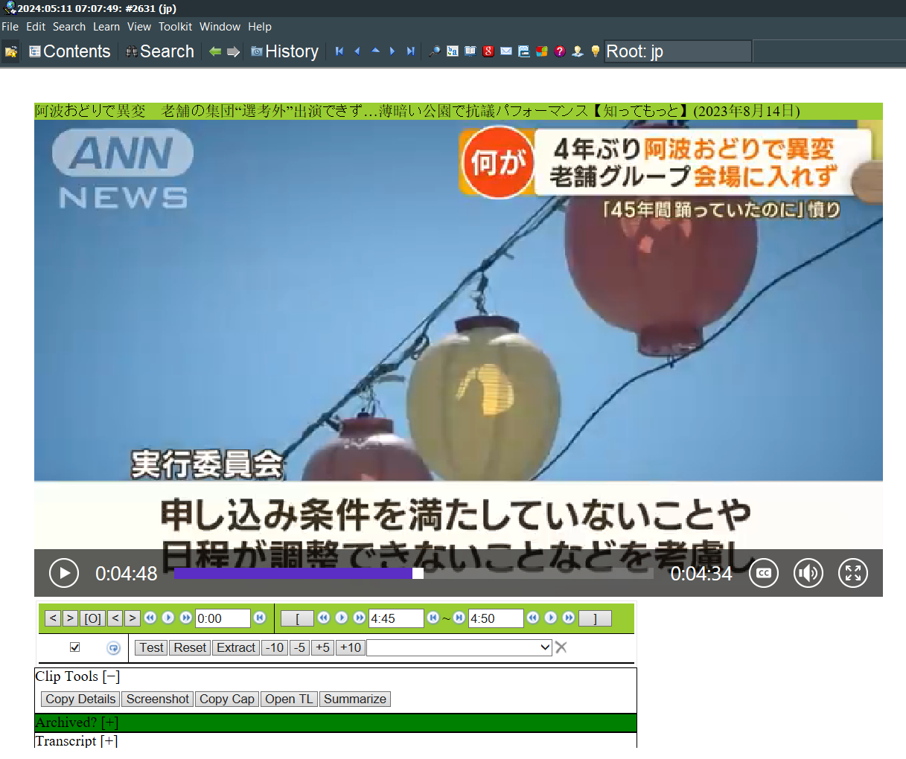

# SuperMemo.js

SuperMemo extract extension engine. Allows user to load different types of React components directly in supermemo. See supported components.

## Supported Components [to be expanded]

### YouTube

- Fixes SuperMemo memleaks and slowdowns in video elements
- Modern react-player is used to extend the functionality of incremental video in SM-18
- Completely extensible with more features
- Archive and load saved videos
- See and copy subtitles!
- And more!

## Foreword

I now consider this a beta and usable, it won't overwrite your cards under expected operation. However, I recommend that you [backup your collection](https://www.supermemo.wiki/en/supermemo/backup-guide) before starting to use this extension.

## Getting Started

### Dependencies

* SuperMemo 18
* Windows 
* NodeJS (install CLI tools if you don't have it already)
* npm

### Quick start

* backup YouTube.htm in your install SuperMemo/bin folder (Usually C:/SuperMemo/bin)

* copy YouTube.htm from this folder over C:/SuperMemo/bin/YouTube.htm, overwriting it

* run `npm install` in supermemo.js root folder

* cd to ytjs folder: `cd ytjs`

* run `npm install` again to install deps for the ytjs server

* cd to root folder: `cd ..`

* run `npm run build` to build the react app that SuperMemo will load

* run `npm run ytjs` to start the video server

* import a YT video in supermemo using CTRL+N

* from now on you will need to run `npm run ytjs` whenever you want to load videos in SM. Restore the backup you made to go back to regular behaviour. 

## Building the react app

Run `npm run build` in the root folder

## How it works

We are capable of loading videos from youtube more quickly. The server does this by running a server with a cached [youtubei.js Innertube](https://github.com/LuanRT/YouTube.js) player and serving the MPD to the player for streaming.

SuperMemo loads a YouTube.htm when video components are loaded. We redirect it to load our own react app directly in SM. Therefore the code is totally extensible. Also, we can hijack the way SM stores YouTube video IDs to store more than just YouTube videos. These IDs are normally only 11 characters. In theory we can store up to 32 characters, which is the limit set by SM. In this data we can store links to other files. Other component types will use this novel technique to extend SuperMemo in an open source way. 

## Using youtube video archive feature

You can archive videos and they'll be loaded instead of from youtube. To do this, in your browser go to http://localhost:3000/archive/<youtube_id_here>/ and wait until you get an OK message. From that point on, the video will be loaded from file storage.

OR

[RECOMMENDED!!!] Open the Archive Pane and click the button for the qulity you want.

Videos are stored in <SUPERMEMO_JS_FOLDER>/dist/archive. You can delete folders by ID at any time.

## Help

### Videos won't load

YouTube is currently experimenting with their API and so videos intermittently might not load. First follow the update instructions to see if a fix is available. If you are having still having trouble, please open an issue. Alternatively, you can scan the FreeTube and NewPipe projects issue pages. These usually indicate when a fix is coming first.

Most recent downtime: 1 day (2024-07-24), [Fixed 2024-07-25]

### Manual subtitles are not saved / V2 migration

There was a bug in the code that caused ONLY the auto caption to be saved if both the manual subs and ASR are on the video. This has been fixed in archive elements with version 2. If you are a new user, you don't need to do anything. Otherwise, follow these instructions:

1. Follow the [backup instructions](#backup-your-collection-and-archive)

2. Follow the [the update instructions](#updating).

3. Ensure you are on a stable internet connection with full battery and will not put your computer to sleep for tle next hour.

4. Open a browser and navigate to http://localhost:3000/v1fix/ . Wait until you see 'done' in the browser and in the console you see the console text 'done updating archive to version 2'. Do not use your collection during this time. Do not refresh the page. Make sure you close the browser tab after you see done message.

### Backup your collection and archive

Backup your supermemo collection via the regular process. Archived videos are stored in <root_folder>/dist/archive, back this up as well.

### Updating

0. Stop the server if it's running

1. Run `git pull` in the root folder

2. run `npm install` in supermemo.js root folder

3. cd to ytjs folder: `cd ytjs`

4. run `npm install` again to install deps for the ytjs server

5. cd to root folder: `cd ..`

6. run `npm run build` to build the react app that SuperMemo will load

7. delete all of the files in the ./cache folder to clear the innertube cache

8. run `npm run ytjs` to start the video server

### One of my extract timestamps wiped!?

This can rarely happen if you hold ALT+LEFT or ALT+RIGHT and cycle theough many cards quickly. You may recover the times from the title of the card.

### Server errors

Restart the server and report the error on issues.

### I'm not sure how to use this...

1. Download the zip off github.
1. Unzip it and go into the unzipped folder. 
1. Copy YouTube.htm and paste it in C:/SuperMemo/bin, replacing the existing YouTube.htm.  
1. Go back to the unzipped folder. [WINDOWS] Hold shift key and right click, select the menu option "open in terminal". You might have to select the more options menu for it to appear.
1. Run all the commands in Getting Started

### Want to change port

CURRENTLY DISABLED: Update the port variables in SMPlayer.tsx and server.ts. Change port in YouTube.htm.

### Want subtitles to autoload

Change prefLangLabel '' to whatever lang you want and run a build, eg English, Japanese, etc.

### Known bugs

- Scrolling elemnts with mouse wheel or keyboard in element browser may wipe YT extracts

- Pressing ctrl+v while the video player is focused and with a YT video in your clipboard overwrites the current YT extract. This may be a SM feature however.

### Differences with vanilla supermemo

- Extract background colour is lost, instead green is used to indicate ambiguity between blue and yellow
- Clicking fields inserts current time

## Version History

* 0.1
    * Mark/Stop/Start buttons work
    * Loading YouTube videos
    * Loads SM scripts locally
* 0.2
    * Nonblocking player and hotkeys
    * Playback speed slider
* 0.3
    * Bypass MEMLEAK in supermemo
    * Load external IE window with YT player
    * Changes reflect back to SM
    * Extracts and navigation work
    * Start, Stop, Mark textbox can be clicked to set times
    * Everything in the UI works
* 1.0 
    * App completely rewritten to react
    * Server caches players so videos load quicker
* 1.1
    * Server can locally archive and load videos
    * Offline mode for watching archived videos
    * More robust to errors
* 2.0
    * Archive quality selector
    * Fixes to downloaded subtitles
    * Cleaner sleek UI that fits on one page, expands based on video type

### Roadmap

* Add Archive component which lets send a video to be archived
* Archive quality selector
* Settings page: subtitle settings, auto archive videos, etc.

## License

See LICENSE

## Acknowledgments

* [SuperMemo yt.htm](https://www.super-memory.com/)

## The coffee pledge

This is a project I started in early 2022 to keep SuperMemo competitive with vendors who promise to lock incremental features behind paywalls. For each donation received, I will take a serendipitous visit to my local coffee shop and work on the app for the duration of the visit.

